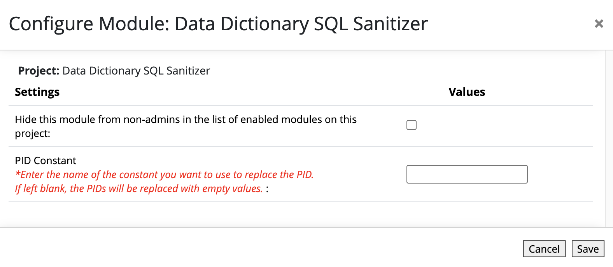
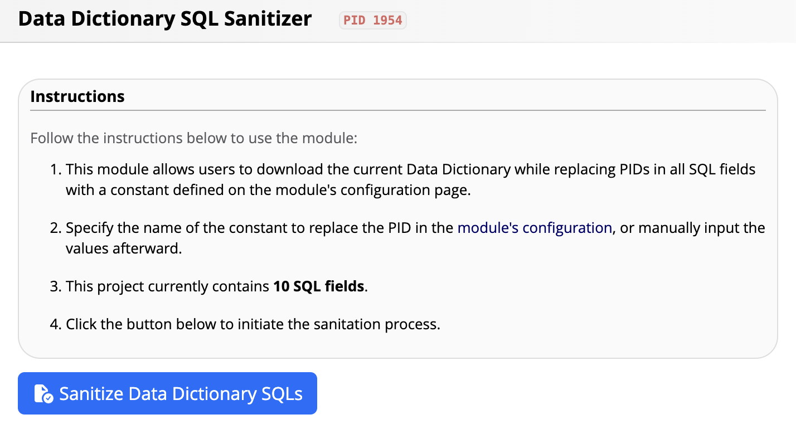
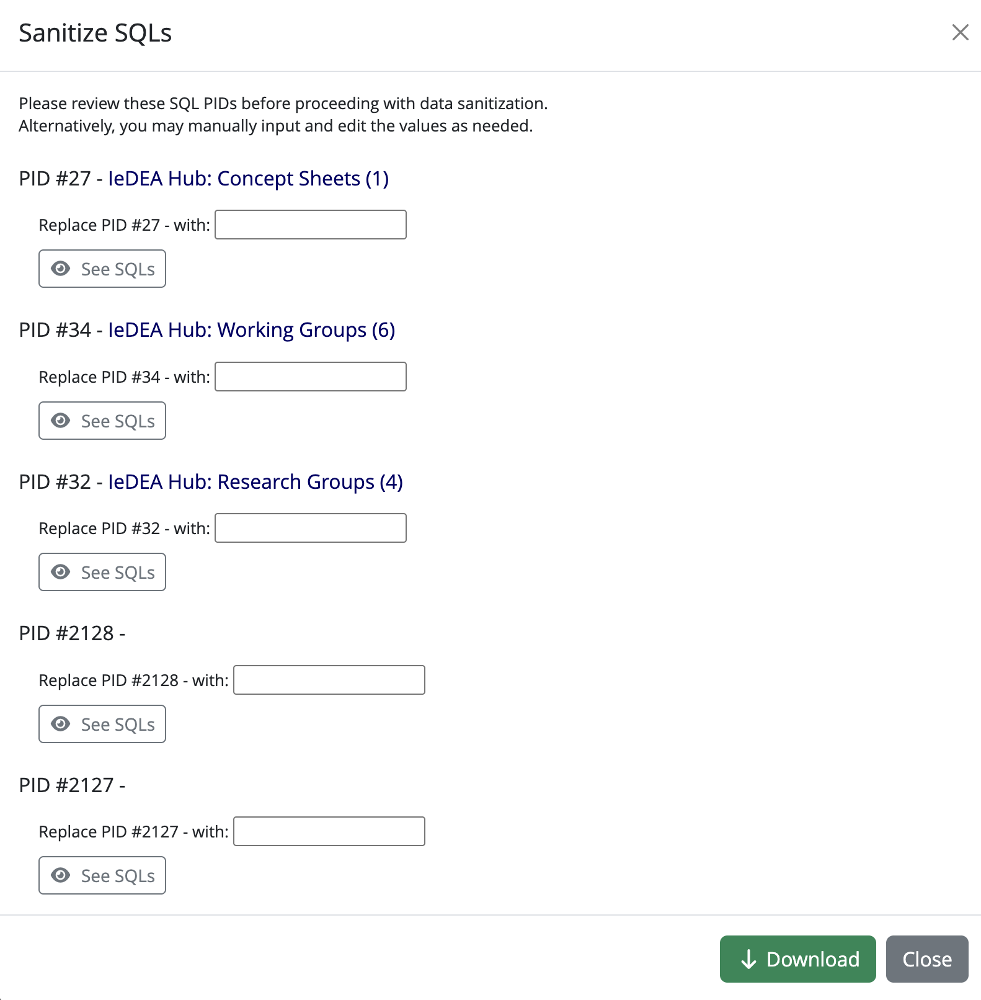
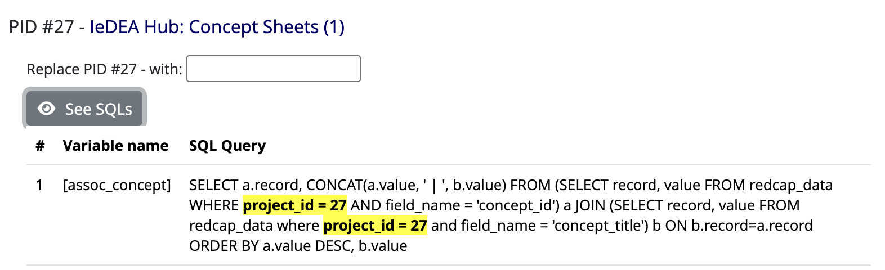
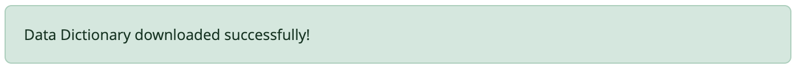

# Data Dictionary SQL Sanitizer

## 🛠 Introduction

The **Data Dictionary SQL Sanitizer** module enables users to download the current Data Dictionary while replacing **PIDs** in all SQL fields with a constant value defined on the module's configuration page.

---

## ⚠️ Limitations

- This module exclusively searches for **PIDs** in SQL fields.
- **No other types of content** are sanitized.

---

## ⚙️ Configuration

While configuration is **optional**, users can provide an incremental constant via the configuration page to replace PIDs. This is done through a single input field.

---

## 🚀 How to Use

### Step 1: Access the Module
Click on the External Module's **DD SQL Sanitizer** link. Instructions will appear explaining the tool's functionality.

### Step 2: Sanitize Data Dictionary SQLs
When ready, click the **Sanitize Data Dictionary SQLs** button. This will open a modal displaying a list of **PIDs** along with all associated SQL fields.

You can click on the **project name** linked to each PID to view the corresponding project's details and associated SQLs.

- If **input fields are left blank**, PIDs will be replaced by quotes (`""`).
- If **values are provided**, PIDs will be replaced by the specified value.

### Step 3: View SQL Fields
Click the **See SQLs** button to preview the SQL fields.  
Each SQL field will display:
- Its associated **variable name**.
- The **highlighted project ID** for easy identification.

### Step 4: Download Updated Data Dictionary
Once satisfied, simply click the **Download** button to save the updated Data Dictionary with sanitized SQL fields.

---

## 🎉 Conclusion

The **Data Dictionary SQL Sanitizer** makes it easy to sanitize sensitive PIDs in SQL fields, ensuring consistency and security across your Data Dictionary exports.